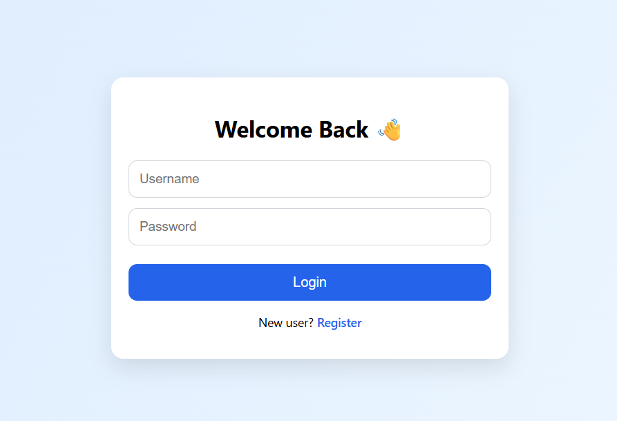
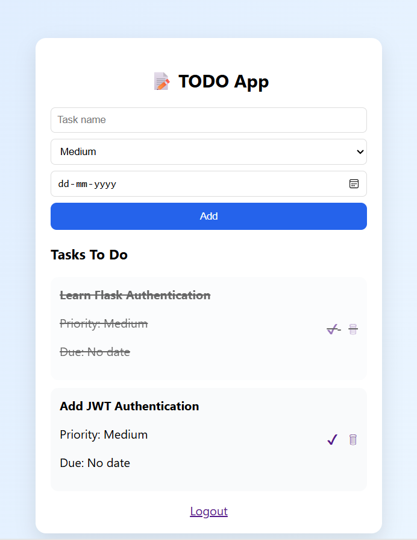
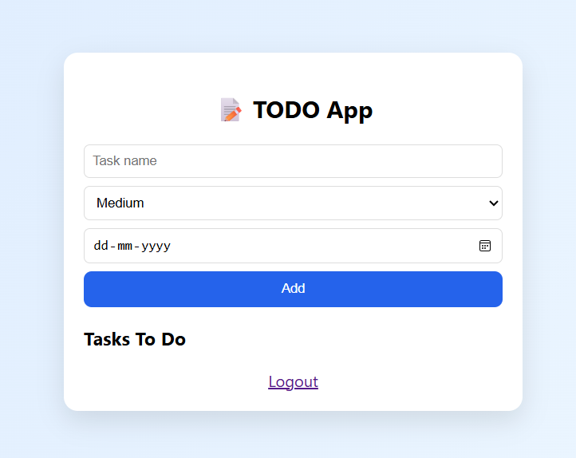

# 📝 Flask ToDo App (Backend Project)

A backend-focused ToDo application built using **Flask** and **SQLAlchemy**, featuring user authentication and full CRUD functionality.  
This project demonstrates core backend concepts such as authentication, database modeling, and secure data handling.

---

## 🚀 Features

- User Registration & Login (Authentication)
- Password hashing for security
- Create, Read, Update, Delete (CRUD) tasks
- User-specific tasks (authorization)
- SQLite database using SQLAlchemy ORM
- Clean and minimal UI (for interaction)
- Flask 3 compatible project structure

---

## 🛠️ Tech Stack

- **Backend:** Flask (Python)
- **Database:** SQLite
- **ORM:** SQLAlchemy
- **Authentication:** Flask sessions
- **Frontend:** HTML, CSS (minimal – focus on backend)

---

## 📸 Screenshots

### 🔐 Login Page


### 📝 Register Page


### ✅ ToDo Dashboard


### ➕ Task Added



## ⚙️ Installation & Setup

- ```bash
- git clone https://github.com/Muskankr/flask-todo-app.git
- cd flask-todo-app

- python -m venv venv
- venv\Scripts\activate  #Windows

- pip install -r requirements.txt
- python app.py

- **Open in browser:**

- http://127.0.0.1:5000/

## 🔐 Authentication Flow

- Users can register with a username and password

- Passwords are securely hashed before storing

- Users log in using valid credentials

- Each user can only access and manage their own tasks

